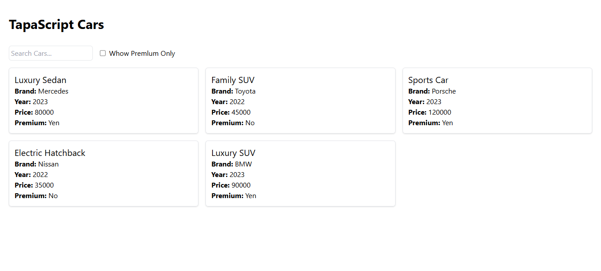
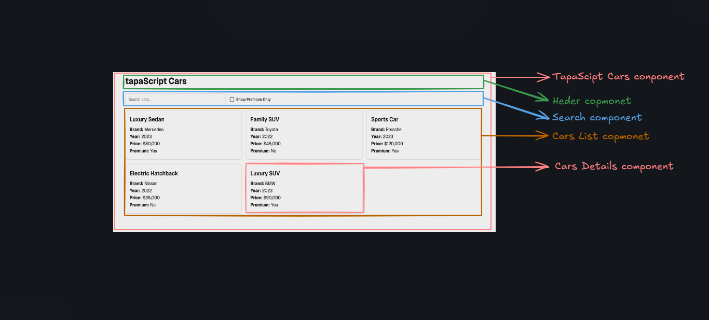
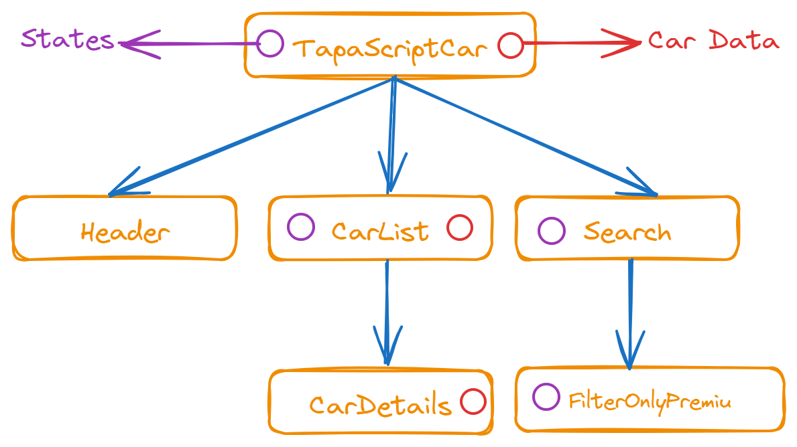

# 🚗 TapaScript Cars

### ☘️ Explain

TapaScirptCar is a fast and interactive React app built with Vite. It displays a list of cars with a search feature and a premium filter option. This app is great for understanding React basics and utilizing Vite for a fast development experience.

---

### 📋 Features

- **Car List Display:** Shows a dynamic list of cars with their details.
- **Search Bar:** Quickly find a car by its brand or other details.
- **Premium Cars Filter:** Filter cars marked as premium using a checkbox.
- **Fast Build & Hot Reload:** Powered by Vite for lightning-fast development.

---

### 🚀 How to Run the Project

1.  Clone the Repository: `git clone https://github.com/khabbab50/TapaScriptCars.git` `cd TapaScriptCars`

2.  Install Dependencies
    Ensure you have Node.js installed. Then run:
    `npm install`

3.  For Tailwindcss `npm install -D tailwindcss` `npx tailwindcss init`

4.  Start the Development Server `npm run dev`

5.  Visit the App:
    Open your browser and navigate to the URL provided by Vite (e.g., http://localhost:5173).

---

### 🌐 Live Demo

Check out the deployed app here: [Click here](https://github.com/khabbab50/TapaScriptCars.git)

---

# 📷 Screenshots

### Component Breakdown diagram

---

### Component Hierarchy diagram

---

### React Dev Tools Screenshot

---

# 🛠️ Tools & Technologies

- React.js
- Vite (for fast builds and development)
- CSS/Tailwind
- Node.js (for local development)
- React Dev Tools
